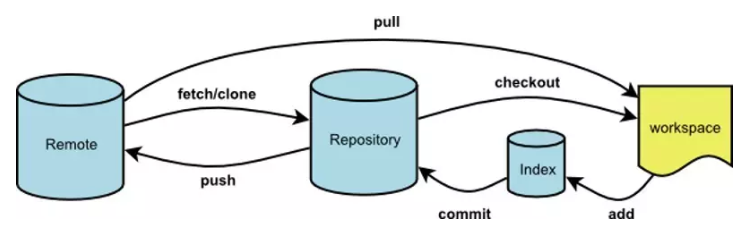

# Git 基础

## 基础概念



- workspace： 本地工作区（即你编辑器的代码）
- Index： Git 追踪树,暂存区；
- Repository： 本地仓库；
- Remote: 远程主仓库；

提交流程

工作区 -> `git status` 查看状态 -> `git add .` 将所有修改加入暂存区-> `git commit -m "提交描述"` 将代码提交到 本地仓库 -> `git push` 将本地仓库代码更新到 远程仓库

## 工作区

提交文件到暂存区

```bash
# 提交单个文件
git add <文件名>

# 提交所有文件
git add .
```

丢弃工作区的修改

```bash
# 丢弃单个文件
git checkout -- <文件名>
```

## 暂存区

将代码提交到本地仓库

```bash
git commit -m “新提交消息”
git commit --amend --no-edit
```

提交完后更改 commit 信息

```bash
git commit --amend -m “新提交消息”
```

部分漏提交的重新提交

```bash
git add <文件名>
git commit --amend --no-edit
```

`--no-edit` 表示提交消息不会更改，在 git 上仅为一次提交

把暂存区的修改撤销掉（unstage），重新放回工作区。

```bash
git reset HEAD <文件名>
```

## 本地仓库

提交本地仓库到远程仓库

```bash
git push

# 强制提交 谨慎使用
git push -f -u origin master
```

### 快捷回退版本

**修改版本库，保留暂存区，保留工作区**

将版本库软回退 1 个版本，软回退表示将本地版本库的头指针全部重置到指定版本，且将这次提交之后的所有变更都移动到暂存区。

```bash
git reset --soft HEAD~1
```

**修改版本库，修改暂存区，修改工作区**

将版本库回退 1 个版本，不仅仅是将本地版本库的头指针全部重置到指定版本，也会重置暂存区，并且会将工作区代码也回退到这个版本

```bash
# 回退到上一个版本
git reset --hard HEAD^

# 回退到上上一个版本
git reset --hard HEAD^^
```

### 回退到指定的版本

先查看版本库的状态

```bash
git log
```

此时会查看到如以下的信息

```
commit e475afc93c209a690c39c13a46716e8fa000c366 (HEAD -> master)
Author: Michael Liao <askxuefeng@gmail.com>
Date:   Fri May 18 21:03:36 2018 +0800

    add distributed

commit eaadf4e385e865d25c48e7ca9c8395c3f7dfaef0
Author: Michael Liao <askxuefeng@gmail.com>
Date:   Fri May 18 20:59:18 2018 +0800

    wrote a readme file
```

回退到指定的版本

```bash
git reset --hard 1094a
```

::: tip
版本号没必要写全，前几位就可以了，Git 会自动去找。当然也不能只写前一两位，因为 Git 可能会找到多个版本号，就无法确定是哪一个了。
:::

git revert 和 git reset 的区别

- git revert 是用一次新的 commit 来回滚之前的 commit，git reset 是直接删除指定的 commit。
- 在回滚这一操作上看，效果差不多。但是在日后继续 merge 以前的老版本时有区别。因为 git revert 是用一次逆向的 commit“中和”之前的提交，因此日后合并老的 branch 时，导致这部分改变不会再次出现，但是 git reset 是之间把某些 commit 在某个 branch 上删除，因而和老的 branch 再次 merge 时，这些被回滚的 commit 应该还会被引入。
- git reset 是把 HEAD 向后移动了一下，而 git revert 是 HEAD 继续前进，只是新的 commit 的内容和要 revert 的内容正好相反，能够抵消要被 revert 的内容。

## Config

```bash
git config --global user.name <your name>
git config --global user.email <your_email@example.com>
git config --global push.default simple
git config --global core.quotepath false
git config --global core.editor /usr/bin/vim
git config --global credential.helper store
git config --global credential.helper wincred
git config --global core.ignorecase false
# 设置大小写敏感，保持 Mac/Win/Linux一致性；在目录名大小写修改时，git可正常提交；
git config --global core.ignorecase false
```
